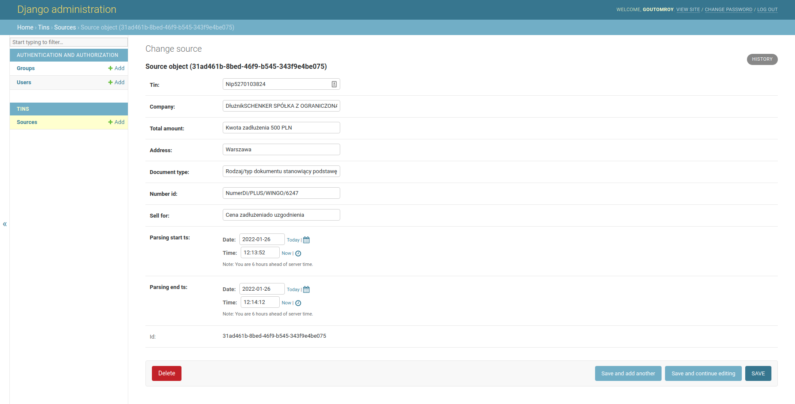

1. Make a parser to get info from https://kaczmarski.pl/gielda-wierzytelnosci (ex. PL5270103824). Use SQLight to save data. Make 2 tables:
   - source (id, tin (tax no i.e.NIP), name (of company), total_amount (of debt), address, document_type, number_id, sell_for, is_exist, start_ts, parsing_ts)
   - tins (id, tin, updated_at)

2. Logic
   * Get tin from table tins order by updated_at desc
   * Get tin from command line in terminal
     - Search info, check if exist
     - Update column updated_at in tins
     - Parse info and save

### Running the server
1. I guess you have installed `python3.9`, `docker`, `docker-compose` in your machine.
2. Download and extract the sourcecode and enter to the folder. Then do the following steps.
3. `pip install -r requirements.txt`
4. `docker-compose up -d`
5. `python manage.py migrate`
6. `python manage.py runserver`
7. `python manage.py createsuperuser`

### Run Celery server
`celery -A temida_homework worker --loglevel=info`

### Admin

`http://127.0.0.1:8000/admin/`
username : kamil
password: kamilkamil123

### Available commands

1. `python manage.py parse_tin --tin PL5270103824`
   ```text
      --tin TIN : Required, TIN/NIP to find the information.
    ```
2. `python manage.py parse_bulk_tins --num_of_records 10`
   ```text
      --num_of_records  : Not Required, Default is 5, Number of records parsed from Tin to parse in bulk.
    ```
3. `python manage.py get_tin_from_db --tin Nip5270103824`
   ```text
      --tin TIN : Required, TIN/NIP to find the information.
    ```
4. `python manage.py get_all_tins_from_db`
    ```text
      --tin TIN : Required, TIN/NIP to find the information.
    ```
5. `python manage.py update_tin --tin Nip5270103824 --sell_for '50000 PLN' --document_type 'Rodzaj/typ dokumentu'`
    ```text
      --tin TIN : Required, TIN/NIP to find the information.
      --sell_for SELL_FOR : Required, Sell information you want to update
      --document_type DOCUMENT_TYPE : Required, Document type you want to update
    ```

#### Database admin

